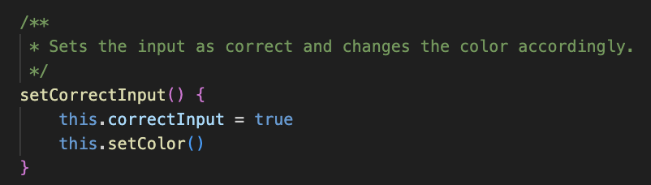

# L2 InputFilter (Refactoring)

### Meaningful names:
If we start by looking at the classnames from the first version and compare them with the refactorered version:  
 

One might argue that names are more related now and increases the context and the understandability. I am having second thoughts, now, analyzing it I think BrowserDisplayText and BrowserDisplayColor for example would have been clearer. If we take a look in the book and see what Uncle Bob states it is that "Classes and objets should have noun or noun phrase names like cusomter, wikipage, account, and AddressesParser". In this case, I would argue that I did not really nail this, maybe it would have been more descriptive to use output-text-IN-browser (OutPutTextInBrowser) instead of output-text-TO-browser. One final thought on the class names is that I have a littel to much information, I feel like we could cut all of the words `browser` and have a classt list which would have been:  
input  
inputProcessor  
inputRule  
outputColor  
outputText  

Other than that, I am kind of happy with my class names using the two themes of input and output. Input clearly coming from the user of the client and output going to the user of the client.

I have been trying to use intention revealing names, some exampels are:  

### Functions
I really tried to adhere to the "Do One Thing" rule and the "One level of Abstraction per Function". As we can see in inputProcessor.js (picture below) we check the regex pattern (this was actually declaring a variable that is an argument now before i refactored) and then call the appropriate function. If the regexPatttern test discovers characters which is not included it calls the proccesInvlaidInput, but if the regexPattern test does not find any "illegal" characters, it calls processValidInput() instead.  

On the other hand, I did not adhear to all the rules, for example we can see an image below where I brek the rule Command Query SEparaiton, (either answer something, or do something), which also breaks the Do One Thing rule. I answer *which color* it is **and** I also *set color* in the same function. 

Below we can see an example where I broke the rule *Have No Side Effects*. This function call comes from an event-listener, I could have easily broken up this function into two different functions and made 2 function invocations from the eventlistener instead of only one. Now we think it only sets the correct input, but it also changes color.  

### Commments
I really tried to adhear to the "Comments do not make up for bad code". Besides JSDoc the L2 only got one comment and that is "// Only one rule can be applicable at the same time". I suspect that the code could have been reworked so that it was self explanatory that only 1 rules is applciable at the same time, but the way my code was structured it was not self explanatory.  

### Formatting
I have tried to take Vertical Formatting and Horizontal Formatting into heart. I cannot really find any parts where there is a need for improvement. I have used vertical spacing between concepts (image below) and I have been consistant with Vertical Density and Vertical Distance. I do not find any issues with the respective rules for Horizontal formatting either.  

### Objects and Data Structures
When writing object oriented code (well) this is something I feel is followed automatically. Although I can see that in my class of inputRules I do not have nifty getters and setters, this entire class feels alittle wonky and should have problably been refactored in a smarter way (which I do manage to do yet). For example in outputColorToBrowser we have setters for if the input is correct or false (image below). Another eye-sore are all the event-listeners in the constructor, that could problably have been done into methods which was invoked from the constructors instead.  

### Error Handling
I actually implemented this in the refactored version when I stumbled upon the fact that there was no input filter in the HTML (crashed). So I implemented this informal error handing by checking for null. I have no other formal error handlin with try-catch statements or throw exceptions. I believe that the null checks are not to many, which Uncle bob warns us about in `Don't Return Null` section.  

### Boundaries
I had no idea when creating L2 how I would implement it in the L3 application (imposter syndrome intensifies), since I did not really had a clear idea on what the L3 app would be then. So I started to export instances of the classes here and there which ultimately led me to have different instances in L3 and L2 of the inputfilter objects that gave me some snags in the application. So Using Code That Does Not Yet Exits was an eye opener (and good education in OOP). Other than that, there is not much to say about this chapter since the L2 does not use any third party dependencies.

### Unit Tests
In L2 I did not implement any units tests but opted for manual testing instead. This is a horrible approach since it makes refactoring an absolute nightmare. When changing something you are not sure if everything keeps working so you need to test the application again which is very time consuming.

### Classes
I have tried keeping the classes in the InputFilter as small as possible (classes should be small!) and focusing on one task only (Single responsibility principle). This is quite clear for a class such as the inputFromBrowser.js (image below). The coupling is not too terrible but its not perfect, for example if I want to change a rule, I would have to do that in inputRules.js and in the outputTextToBroswer.js (to add another text), althought I would not have to do any changes in inputProcessor.js since this is totally decoupled and prepared for chagnes.  

### Systems
I got one eureka moment when I saw that I needed an instance of inputRules in my inputProcessor class so I decided to use a dependency injection there but other than that, I have failed to use dependency injection which would keep the system more modular and decoupled. E.g. if the InputProcessor which needs an object of inputFromBrowser and outputColorToBroswer used dependency injection instead of creating the objects self, it would not need to worry about the implementation of inputFromBroswer and outputColorToBrowser since it would receive finished objects. If we changed the implementation of inputFromBrowser and outputColorToBrowser we would also have to make corresponding change to inptuProcessor and this is not decoupled and modular design. Kind of funny that I realized it once but failed to generalize the idea on the rest of the instances which were created in the same (!) constructor.  

# L3 Quiz-Application

### Meaningful names:
If we start with the classes I feel that they are good, sticking to `Pick one word per concept` and the word I focused on here was **quiz**, although one might wonder if the word quiz is needed at all since the application is a quiz. I do believe that the layout I have is better than:
organizer  
question-display  
question-fetcher  
questions  
user-input-handler  
  
  Altough these would havae been very clear aswell.

I feel that my naming in this module/application is very clear, there are no real awful example but rather I am quite proud, for instance check the image example below.  

I have failed here and there when I keep adding redundant word (or gratuitous context) such as sendAnswerForProcess instead of just writing it as processAnswer:  

### Functions
I tried keeping them as small as possible, doing only one thing, but the constructor (and class) in QuizOrganizer is a monstrocity (image below). I should have removed all the eventlisteners and made their own functions and invoked the functions from the constructor instead. Also, i should have used more dependency injections (more on that later).  

### Comments
In L3 I also have trid to adhear to the rule `Comments do not make up for bad code`, so besides the JSDoc there are no comments in L3. I believe and hope that the code is sufficient self explanatory to leave comments out. 

### Formatting
As always the vertical and horizontal formatting is something we adhear to. I believe that there is a strong consistency in both vertical spacing, vertical density, vertical distance, horizontal openness, horizontal density and horizontal alignment. For instance, theres an example in the image below which demonstrate this consistency:  
  

### Objects and Data structures
In my quiz-questions class I have tried to use objects to send data, as this seem to be the general good practice (image below). Furthermore, I believe the class is almost just a container for data for now, this does not align well with OOP but for this small program (quiz-application) I believe its sufficient.   

### Error Handling
I only found one minimal error (image below) handling and its an if-else statement, as in L2 I do not implement proper formal error handling which is a super clear weakness in the quality of my applications.  

### Boundaries
This is my weakest area, the quiz-application (L3) depends upon the inputProcessor (l2), and I believe now that a proper way to do this would have been to use a main-file which is the "organizer" of both the quiz-application and the input-processor. In that Main-file I could have used a dependency injection, e.g. instantiated the quiz-application with the input-processor as a parameter and hence keeping things modular since the input processor could have been free to change and the quiz-application could have implemented those changes without changing itself.

### Unit Tests
I resorted to manual testing since creating automatic tests with Jest was quite cumbersome when you have no real idea of the framework. I implemented tests of pressing the 3 different buttons on the startscreen but i did not get further than that since the difficulty level felt like it increased ten-fold and I believe that the focus of this couse is not purely automatic tests but clean (quality) code in general. I have gotten the tests to work, implemented more features and the tests failed, gotten them working again -> implementing more features, tests starts failing again (image for reference). So clearly I am lacking understanding on how to implement good quality tests which will stand the test of time as the project grows.  

### Classes
Now this quiz-application is a small application but the class quiz-organizer is monumentally larger than the other classes and handles maybe alittle too many things and not adhearing to SRP, might call it a "mini-god-class". It should problably have been divided into a lot smaller classes, could have been something like 1 for handling user input, 1 for handling screen transitions, 1 for handling the gameplay. The red line or cohesion of the quizOrganizer (or atleast this was my methodology when implementing the code) is that the quizOrganizer is the controller when it comes to the flow of the quiz-game.

On the other hand, I have some classes which are really small where SRP is the name of the game and having anything besides cohesion is impossible, the quiz-question-displayer in particularly (example in image below).  

### Systems
Here we have ying and yang, I have these small classes which does one thing and does it well. On the other hand, we have this big blob class QuizOrganizer which is doing way to much and is way to nestled. I believe that the QuizOrganizer could have benefitted from a little refactoring. If we look at `Seperate constructing a system from using it` and then we look at the image below, we can clearly see that we have missed this point totally. There are some silver linings where we use dependency injections to create objects instead of creating them inside the constructor of other classes, but they are few.

