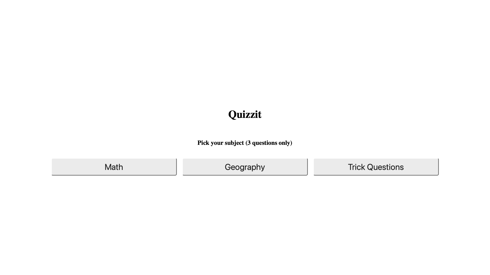
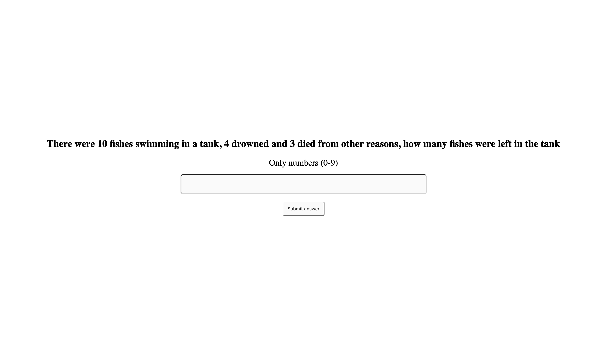
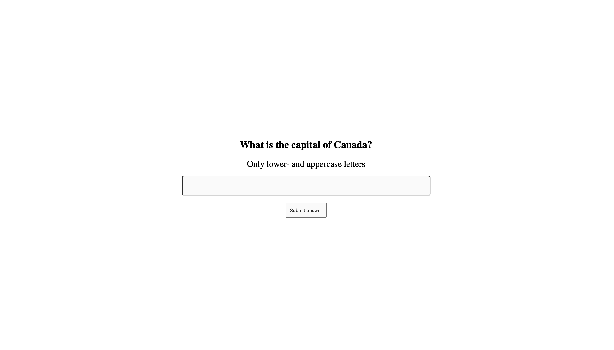
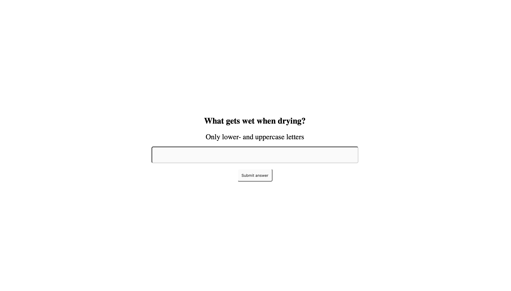

| What was tested                                   | How it was tested                                                                                       | Test result                                                    |
|---------------------------------------------------|----------------------------------------------------------------------------------------------------------|---------------------------------------------------------------|
| 1.1 Loading the page                                   | Go to https://the-quiz-application.netlify.app                                                          | Worked as expected                                             |
| 2.1 Test to load the Math mode of the quiz             | Clicking on the button with the text `Math`                                                             | Worked as expected                                             |
| 2.2 Test to load the Geography mode of the quiz        | Clicking on the button with the text `Geopgraphy`                                                       | Worked as expected                                             |
| 2.3 Test to load the Trick Questions mode of the quiz  | Clicking on the button with the text `Trick Questions`                                                  | Worked as expected                                             |
| 3.1 Test the dynamic instructions with Math mode       | Clicking on the button with the text `Math`                                                             | Worked as expected                                             |
| 3.2 Test the dynamic instructions with Geography mode  | Clicking on the button with the text `Geography`                                                       | Worked as expected                                             |
| 3.3 Test the dynamic instructions with Trick Questions mode | Clicking on the button with the text `Trick Questions`                                              | Worked as expected                                             |
| 4.1 Test the correct answer in Math Mode           | Entering the correct answer in `Math` Mode                                 | Worked as expected                                             |
| 4.2 Test the incorrect answer in Math Mode         | Entering the incorrect answer in `Math` Mode                                | Worked as expected                                             |
| 4.3 Test the correct answer in Geography Mode      | Entering the correct answer in `Geopgraphy` Mode                                                                  | Worked as expected                                             |
| 4.4 Test the incorrect answer in Geography Mode    | Entering the incorrect answer in `Geopgraphy` Mode                                                              | Worked as expected                                             |
| 4.5 Test the correct answer in Trick Questions Mode| Entering the correct answer in `Trick Questions` Mode                                                                  | Worked as expected                                             |
| 4.6 Test the incorrect answer in Trick Questions Mode| Entering the incorrect answer in `Trick Questions` Mode                                                              | Worked as expected                                             |
| 5.1 Finish the game in Math Mode                       | Answer three questions in `Math` Mode                                                   | Worked as expected                                             |
| 5.2 Finish the game in Geography Mode                  | Answer three questions in `Geopgraphy` Mode                                               | Worked as expected                                             |
| 5.3 Finish the game in Trick Questions Mod             | Enter three questions in `Trick Questions` Mode                                                    | Worked as expected                                             |

# 1. Chosing game modes
## 1.1 Loading the page
### Preconditions
Open a browser.
### Expected Output
A webpage "Quizzit" which shows 3 different quiz topics.
### Input
Go to https://the-quiz-application.netlify.app
### Output
Works as expected

## 1.2 Loading the Math Mode
### Preconditions
The page https://the-quiz-application.netlify.appis is loaded.
### Expected Output
The page should change view from the start page to the page with math quizes.
### Input
Click on the button `Math`
### Output
Works as expected

## 1.3 Loading the Geography Mode
### Preconditions
The page https://the-quiz-application.netlify.appis is loaded.
### Expected Output
The page should change view from the start page to the page with geography quizes.
### Input
Click on the button `Geography`
### Output
Works as expected

## 1.4 Loading the Trick Questions Mode
### Preconditions
The page https://the-quiz-application.netlify.appis is loaded.
### Expected Output
The page should change view from the start page to the page with geography quizes.
### Input
Click on the button `Trick Questions`
### Output
Works as expected

# 2 Loading game modes
## 2.1 Loading the Math Mode
### Preconditions
The page https://the-quiz-application.netlify.appis is loaded.
### Expected Output
The page for `Math questions` should appear.
### Input
Click on the button `Math`
### Output
Works as expected

## 2.2 Loading the Geography Mode
### Preconditions
The page https://the-quiz-application.netlify.appis is loaded.
### Expected Output
The page for `Geography questions` should appear.
### Input
Click on the button `Geography`
### Output
Works as expected

## 2.3 Loading the Trick Questions Mode
### Preconditions
The page https://the-quiz-application.netlify.appis is loaded.
### Expected Output
The page for `Trick questions` should appear.
### Input
Click on the button `Trick Questions`
### Output
Works as expected

# 3 Dynamic instructions
## 3.1 Loading dynamic instructions with Math Mode
### Preconditions
The page https://the-quiz-application.netlify.appis is loaded with the Math Mode.
### Expected Output
The instructions `Only numbers (0-9)` should appear.
### Input
None.
### Output
Works as expected

## 3.2 Loading dynamic instructions with Geography
### Preconditions
The page https://the-quiz-application.netlify.appis is loaded with the Geography Mode.
### Expected Output
The instructions `Only lower- and uppercase letters` should appear.
### Input
None.
### Output
Works as expected

## 3.3 Loading dynamic instructions with Trick Questions
### Preconditions
The page https://the-quiz-application.netlify.appis is loaded with the Trick Questions Mode.
### Expected Output
The instructions `Only lower- and uppercase letters` should appear.
### Input
None.
### Output
Works as expected

## 4.1 Enter correct answer in Math mode
### Preconditions
The page https://the-quiz-application.netlify.appis is loaded with the Math Mode.

### Expected Output
The page should transition from `Math Mode`page into a light green background and then back to the `Math Mode` page with a white background.
### Input
The correct answer to the question.
### Output
Works as expected

## 4.2 Enter incorrect answer in Math mode
### Preconditions
The page https://the-quiz-application.netlify.appis is loaded with the Math Mode.
### Expected Output
The page should transition from `Math Mode`page into a red background and then back to the `Math Mode` page with a white background.
### Input
The incorrect answer to the question.
### Output
Works as expected

## 4.3 Enter correct answer in Geography mode
### Preconditions
The page https://the-quiz-application.netlify.appis is loaded with the Geography Mode.
### Expected Output
The page should transition from `Geography Mode`page into a light green background and then back to the `Geography Mode` page with a white background.
### Input
The correct answer to the question.
### Output
Works as expected

## 4.4 Enter incorrect answer in Geography mode
### Preconditions
The page https://the-quiz-application.netlify.appis is loaded with the Geography Mode.
### Expected Output
The page should transition from `Geography Mode`page into a red background and then back to the `Geography Mode` page with a white background.
### Input
The incorrect answer to the question.
### Output
Works as expected

## 4.5 Enter correct answer in Trick Questions mode
### Preconditions
The page https://the-quiz-application.netlify.appis is loaded with the Trick Questions Mode.
### Expected Output
The page should transition from `Trick Questions Mode`page into a light green background and then back to the `Trick Questions Mode` page with a white background.
### Input
The correct answer to the question.
### Output
Works as expected

## 4.6 Enter incorrect answer in Trick Questions mode
### Preconditions
The page https://the-quiz-application.netlify.appis is loaded with the Trick Questions Mode.
### Expected Output
The page should transition from `Trick Questions Mode`page into a red background and then back to the `Trick Questions Mode` page with a white background.
### Input
The incorrect answer to the question.
### Output
Works as expected

# 5 Finish the game
## 5.1 Enter three questions in Math mode
### Preconditions
Answered two questions and on the page for answering the third question.
### Expected Output
The start page should load where the user can chose subject again.
### Input
Answer the third question.
### Output
Works as expected

## 5.2 Enter three questions in Geography mode
### Preconditions
Answered two questions and on the page for answering the third question.
### Expected Output
The start page should load where the user can chose subject again.
### Input
Answer the third question.
### Output
Works as expected

## 5.3 Enter three questions in Trick Questions mode
### Preconditions
Answered two questions and on the page for answering the third question.
### Expected Output
The start page should load where the user can chose subject again.
### Input
Answer the third question.
### Output
Works as expected